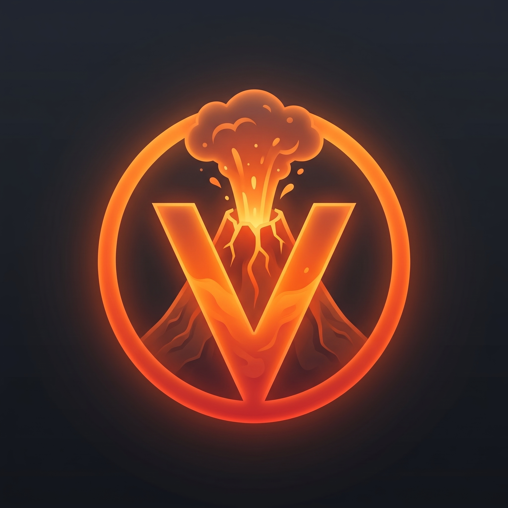

# Vuldium

**Vuldium** is a next-generation high-performance rendering engine and optimization suite for Minecraft, built for both **Vulkan** and modern **OpenGL**.

### ⚡ Key Features
- **Multi-AI Frame Generation (x2 / x3)**: Synthesizes high-fluidity intermediate frames directly in the swapchain for buttery smooth motion.
- **AI & Spatial Upscaling**: Native FSR, XeSS, and DLSS pipelines for crystal-clear resolution scaling.
- **Zero-Allocation Chunk Pipelines**: Fully optimized hot-path chunk rendering with cached geometry and direct native command streams.
- **Hardware Ray Tracing (VK_KHR_ray_query)**: Real-time voxel RTAO and contact shadows.
- **Hi-Z & Mesh Shader Culling**: GPU-driven occlusion culling eliminating invisible geometry before rasterization.
- **Full Mod Compatibility**: Integrated support for Fabric and NeoForge with FRAPI and OptiFine-like configuration tabs (Animations, Particles, Details, Render, Extra).

---

### 📥 Downloads

#### Stable builds

The latest stable release of Sodium can be downloaded from our official [Modrinth](https://modrinth.com/mod/sodium) and
[CurseForge](https://www.curseforge.com/minecraft/mc-mods/sodium) pages.

#### Nightly builds (for developers)

We also provide bleeding-edge builds ("nightlies") which are useful for testing the very latest changes before they're
packaged into a release. These builds are primarily intended for other mod developers and users with expert skills, and do
not come with any support or warranty.

For a complete listing of available nightly builds, please see [the wiki page](https://github.com/CaffeineMC/sodium/wiki/Nightly-Builds). We also have a Maven repository for including Sodium in your development workspace or build process, for which you can also find [documentation on our wiki](https://github.com/CaffeineMC/sodium/wiki/CaffeineMC-Maven-&-Config-API).

### 🖥️ Installation

Since the release of Sodium 0.6.0, both the _Fabric_ and _NeoForge_ mod loaders are supported. We generally recommend
that new users prefer to use the _Fabric_ mod loader, since it is more lightweight and stable (for the time being.)

For more information about downloading and installing the mod, please refer to our [Installation Guide](https://github.com/CaffeineMC/sodium/wiki/Installation).

### 🙇 Getting Help

For technical support (including help with mod installation problems and game crashes), please use our
[official Discord server](https://caffeinemc.net/discord).

### 📬 Reporting Issues

If you do not need technical support and would like to report an issue (bug, crash, etc.) or otherwise request changes
(for mod compatibility, new features, etc.), then we encourage you to open an issue on the
[project issue tracker](https://github.com/CaffeineMC/sodium/issues).

Please note that while the issue tracker is open to feature requests, development is primarily focused on
improving compatibility, performance, and finishing any unimplemented features necessary for parity with
the vanilla renderer.

### 💬 Join the Community

We have an [official Discord community](https://caffeinemc.net/discord) for all of our projects. By joining, you can:
- Get installation help and technical support for all of our mods
- Get the latest updates about development and community events
- Talk with and collaborate with the rest of our team
- ... and just hang out with the rest of our community.

## ✅ Hardware Compatibility

We only provide official support for graphics cards which have up-to-date drivers that are compatible with OpenGL 4.5
or newer. Most graphics cards released in the past 12 years will meet these requirements, including the following:

- AMD Radeon HD 7000 Series (GCN 1) or newer
- NVIDIA GeForce 400 Series (Fermi) or newer
- Intel HD Graphics 500 Series (Skylake) or newer

Nearly all graphics cards that are already compatible with Minecraft (which requires OpenGL 3.3) should also work
with Sodium. But our team cannot ensure compatibility or provide support for older graphics cards, and they may
not work with future versions of Sodium.

#### OpenGL Compatibility Layers

Devices which need to use OpenGL translation layers (such as GL4ES, ANGLE, etc.) are not supported and will very likely
not work with Sodium. These translation layers do not implement required functionality, and they suffer from underlying
driver bugs which cannot be worked around.

## 🛠️ Building from sources

Sodium uses the [Gradle build tool](https://gradle.org/) and can be built with the `gradle build` command. The build
artifacts (production binaries and their source bundles) can be found in the `build/mods` directory.

The [Gradle wrapper](https://docs.gradle.org/current/userguide/gradle_wrapper.html#sec:using_wrapper) is provided for ease of use and will automatically download and install the
appropriate version of Gradle for the project build. To use the Gradle wrapper, substitute `gradle` in build commands
with `./gradlew.bat` (Windows) or `./gradlew` (macOS and Linux).

### Build Requirements

- OpenJDK 21
    - We recommend using the [Eclipse Temurin](https://adoptium.net/) distribution as it's regularly tested by our developers and known
      to be of high quality.
- Gradle 8.10.x
    - Typically, newer versions of Gradle will work without issues, but the build script is only tested against the
      version used by the [wrapper script](/gradle/wrapper/gradle-wrapper.properties).

## 📜 License

Except where otherwise stated (see [third-party license notices](thirdparty/NOTICE.txt)), the content of this repository is provided
under the [Polyform Shield 1.0.0](LICENSE.md) license by [JellySquid](https://jellysquid.me).
